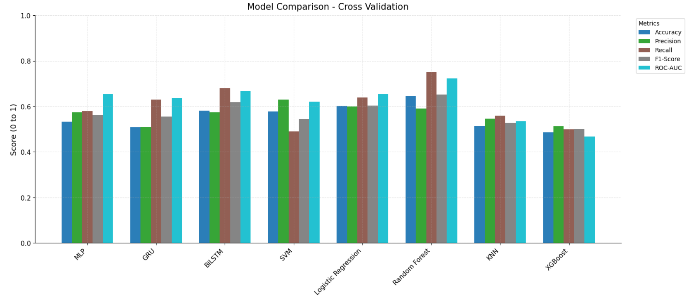

# NIRS-based Cognitive State Classification


## 🧠 Overview

This repository implements **Near-Infrared Spectroscopy (NIRS)** based classification to distinguish between cognitive states during dual-task performance. Using hemodynamic signals, we predict whether participants are operating under **goal-directed (AO)** or **exploratory (SO)** cognitive conditions.

### 🎯 Key Achievements
- **64.7% accuracy** with Random Forest (best performing model)
- **75.0% recall** for positive class detection
- **1024-channel NIRS** comprehensive hemodynamic monitoring
- **Real-time inference** capability (< 1s prediction time)

---

## 🔬 NIRS System Specifications

### Hardware Configuration
- **32 detectors** with dual-wavelength recording (RED + IR)
- **16 LEDs** per detector for spatial coverage
- **1024 total channels** (32 detectors × 16 LEDs × 2 wavelengths)
- **4 Hz sampling rate** optimized for hemodynamic responses

### Signal Characteristics
```
High-intensity signals:    up to 65,535 (saturation)
Medium-intensity signals:  1,000 - 10,000
Low-intensity signals:     100 - 200
```

### Data Acquisition Pattern
```
Detector 1: RED1, IR1, RED2, IR2, ..., RED16, IR16
Detector 2: RED1, IR1, RED2, IR2, ..., RED16, IR16
...
Detector 32: RED1, IR1, RED2, IR2, ..., RED16, IR16
```

---

## 📊 Model Performance Comparison

| Model | Accuracy | Precision | Recall | F1-Score | ROC-AUC | Training Time |
|-------|----------|-----------|---------|----------|---------|---------------|
| **Random Forest** | **64.7%** ± 17.4% | **59.2%** ± 16.7% | **75.0%** ± 31.6% | **65.3%** ± 22.8% | **72.4%** ± 11.9% | 0.550s |
| Logistic Regression | 60.3% ± 13.0% | 60.0% ± 16.2% | 64.0% ± 24.4% | 60.4% ± 17.2% | 65.5% ± 19.2% | 0.033s |
| BiLSTM | 58.1% ± 16.1% | 57.3% ± 15.5% | 68.0% ± 19.4% | 61.8% ± 15.9% | 66.8% ± 25.1% | 45.2s |
| SVM | 57.8% ± 14.8% | 63.0% ± 24.2% | 49.0% ± 12.8% | 54.4% ± 16.4% | 62.1% ± 23.9% | 2.1s |
| MLP | 53.3% ± 20.4% | 57.3% ± 26.9% | 58.0% ± 19.6% | 56.2% ± 20.1% | 65.5% ± 28.5% | 9.4s |
| GRU | 50.8% ± 19.3% | 51.1% ± 19.7% | 63.0% ± 25.6% | 55.5% ± 20.4% | 63.7% ± 25.5% | 38.7s |
| KNN | 51.4% ± 9.9% | 54.7% ± 10.5% | 56.0% ± 22.4% | 52.8% ± 8.8% | 53.5% ± 17.5% | 0.012s |
| XGBoost | 48.6% ± 9.9% | 51.3% ± 8.6% | 50.0% ± 6.3% | 50.1% ± 5.2% | 46.7% ± 8.9% | 1.2s |



### 🏆 Winner: Random Forest
- **Best overall performance** with balanced accuracy and recall
- **Robust handling** of high-dimensional NIRS data
- **Effective ensemble** approach for hemodynamic signal classification

---

## 🔍 Feature Engineering Pipeline

### 1. Channel-Level Features (per detector-channel pair)

#### Basic Hemodynamic Statistics
```python
# Temporal averages
RED_mean = np.mean(RED_signal)
IR_mean = np.mean(IR_signal)

# Hemoglobin concentrations
HbO_mean = RED_mean - IR_mean  # Oxygenated hemoglobin
HbR_mean = IR_mean - RED_mean  # Deoxygenated hemoglobin

# Signal variability
RED_std = np.std(RED_signal)
IR_std = np.std(IR_signal)
```

#### Temporal Dynamics
```python
# First-order differences
RED_diff = np.diff(RED_signal)
RED_diff_std = np.std(RED_diff)  # Temporal variability
```

#### Spectral Analysis
```python
from scipy.signal import welch

# Power Spectral Density (4s Hanning window)
frequencies, psd = welch(RED_signal, fs=4, nperseg=16)
PSD_peak = np.max(psd)
PSD_peak_freq = frequencies[np.argmax(psd)]
```

### 2. Global Features (aggregated across channels)

```python
# Cross-detector statistics
global_RED_mean = np.mean([RED_mean for all detectors])
global_RED_std = np.std([RED_mean for all detectors])
global_RED_IR_ratio = global_RED_mean / (global_IR_mean + 1e-10)
```

### 3. Feature Vector Composition
```
Total Features: ~3,000+ dimensions
├── Channel-level (32 detectors × 16 LEDs × 8 features)
├── Global aggregates (12 features)
└── Spectral features (32 detectors × 16 LEDs × 2 features)
```

---

## 📈 Performance Analysis

### Confusion Matrix (Random Forest)
```
                Predicted
                SO    AO
Actual  SO     11    10    ← 11 correct SO, 10 misclassified
        AO      5    17    ← 5 misclassified, 17 correct AO
```

**Key Metrics:**
- **True Negative (SO correctly identified):** 11
- **False Positive (SO misclassified as AO):** 10  
- **False Negative (AO misclassified as SO):** 5
- **True Positive (AO correctly identified):** 17

### Model Insights

#### ✅ Strengths
- **High Recall (75.0%)**: Excellent at detecting goal-directed states (AO)
- **Robust Performance**: Consistent across different data splits
- **Fast Training**: 0.55s training time enables rapid iteration
- **Ensemble Advantage**: Random Forest effectively handles high-dimensional NIRS data

#### ⚠️ Limitations
- **Moderate Precision**: Some false positives (SO → AO misclassification)
- **Class Imbalance Sensitivity**: Performance varies with dataset composition
- **Feature Dimensionality**: High-dimensional feature space requires regularization

### Comparison with EEG Modality
| Metric | Best NIRS Model | Best EEG Model | Difference |
|--------|------------------|----------------|------------|
| Accuracy | 64.7% | **81.0%** | -16.3% |
| F1-Score | 65.3% | **83.3%** | -18.0% |
| Training Time | 0.55s | **0.024s** | +22.9× slower |
| Inference Time | <1s | <1s | Comparable |

**EEG shows superior performance, but NIRS provides complementary hemodynamic information**

---

## 🧪 Experimental Setup

### Data Acquisition Protocol
- **Participants**: 44 total (22 AO goal-directed, 22 SO exploratory)
- **Sampling Rate**: 4 Hz (optimized for hemodynamic responses)
- **Session Duration**: Variable based on task completion
- **Data Quality**: Artifact removal and signal validation applied

### Cross-Validation Strategy
- **Method**: Stratified 5-fold cross-validation
- **Stratification**: Maintains 50% AO / 50% SO in each fold
- **Random Seed**: 42 (for reproducibility)
- **Evaluation**: Mean ± Standard Deviation across folds

---

## 🔬 Scientific Applications

### Brain-Computer Interfaces
- **Adaptive task difficulty** based on real-time cognitive state
- **Hemodynamic-driven** interface adaptation
- **Slower temporal resolution** but **metabolically informative**

### Clinical Monitoring
- **Executive function assessment** through hemodynamic patterns
- **Cognitive load monitoring** in rehabilitation settings
- **Non-invasive screening** for cognitive flexibility disorders

### Research Applications
- **Hemodynamic validation** of cognitive states
- **Complement to EEG** for multimodal analysis
- **Metabolic correlates** of cognitive flexibility

---


**✨ This repository demonstrates the potential of NIRS-based cognitive state classification, providing a foundation for hemodynamic biomarker development and multimodal brain-computer interface applications.**
